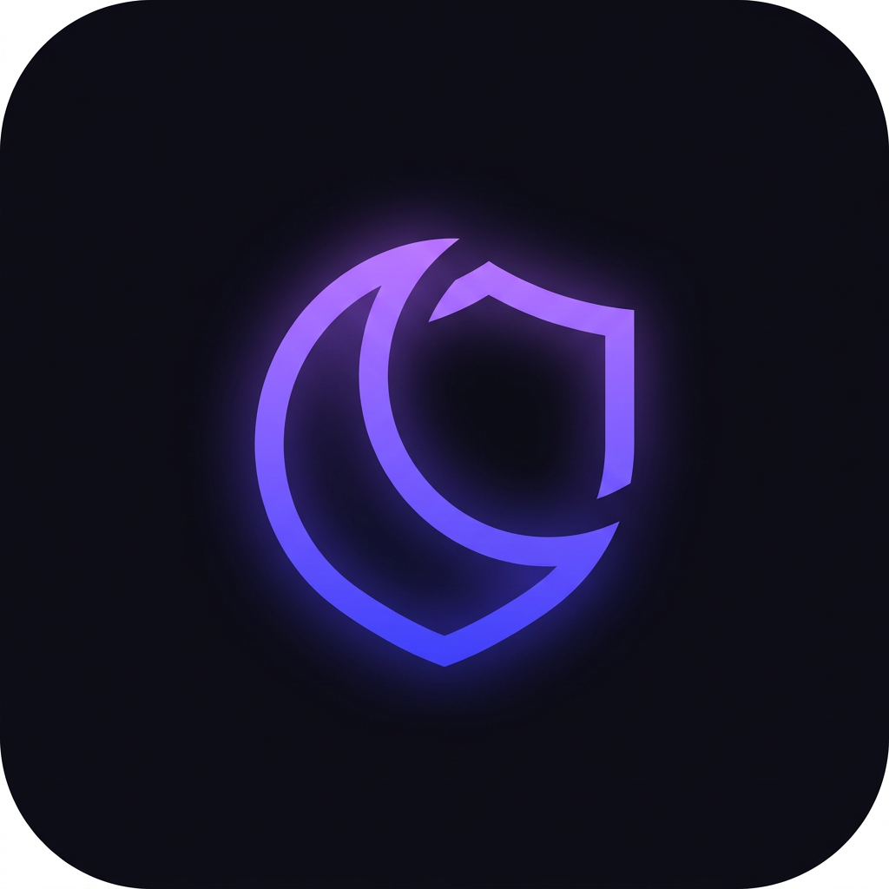

<p align="center">
  
</p>

# Umbra — приватный мессенджер

Аналог Telegram с приоритетом на приватность: **end-to-end шифрование** на стороне
клиентов, минимальные метаданные, регистрация без номера телефона и пароля — только
по публичным ключам.

> **Umbra** (лат. «тень») — мессенджер, в котором сервер не видит ни одного сообщения.
> Этот репозиторий — серверная часть. Android-клиент в разработке.

> ⚠️ **Архитектурный принцип:** сервер **не видит и не может прочитать** ни одного
> сообщения или файла при соблюдении клиентом E2E-протокола. Он хранит открытые ключи
> (для X3DH-рукопожатия) и готовый шифротекст (`ciphertext`). Клиент не передаёт
> серверу ключи расшифровки, nonce и исходные имена файлов в открытом виде.

## Что реализовано (MVP)

- Регистрация по `username` + набор публичных ключей (Ed25519 для подписи, X25519 для E2E).
- Challenge-response аутентификация: сервер шлёт nonce, клиент подписывает его Ed25519 — никаких паролей.
- Получение pre-key пакета пользователя для X3DH-рукопожатия.
- Отправка/получение зашифрованных сообщений (1-на-1) + realtime-доставка по WebSocket.
- Загрузка зашифрованных фото, видео, файлов и голосовых через multipart и скачивание сырых байтов по id.
- Файловое BlobStore с атомарной записью, проверкой id и лимитом 50 MiB по умолчанию.
- In-memory хранилище (разработка/тесты) и PostgreSQL (продакшн).
- Метаданные медиа: id, владелец, MIME, размер ciphertext и время создания; ключи и имена файлов не сохраняются.
- Групповые чаты и каналы с ролями (owner/admin/member), рассылка зашифрованных сообщений участникам через WebSocket.
- Контакты и эфемерный индикатор «печатает» (TTL 5 с, не логируется).
- Голосовые и видеозвонки: сигналинг (initiate/signal/status) через WebSocket-хаб; медиа идёт peer-to-peer (WebRTC).

## Стек

- **Go 1.27** (стандартная библиотека + `gorilla/websocket` + `pgx`)
- **PostgreSQL 16**
- **Docker** / Docker Compose

## Структура

| Путь внутри `server/` | Назначение |
|---|---|
| `cmd/server/main.go` | Точка входа, открытие и закрытие хранилищ |
| `internal/blobstore/` | Интерфейс BlobStore и файловая реализация |
| `internal/config/` | Настройки из env |
| `internal/crypto/` | Серверные крипто-примитивы из стандартной библиотеки |
| `internal/httpapi/` | REST, медиа и WebSocket API |
| `internal/model/` | Пользователи, сообщения и метаданные медиа |
| `internal/store/` | Memory / PostgreSQL |
| `internal/ws/` | WebSocket-хаб |
| `migrations/001_init.sql`, `migrations/002_media.sql` | Схема БД и таблица медиа |
| `scripts/smoke-media.py`, `scripts/mediafixture/` | Curl-проверка и отдельный тестовый клиент |
| `Dockerfile`, `docker-compose.yml`, `Makefile`, `.env.example` | Сборка, запуск и окружение |

## Быстрый старт (in-memory, без БД)

```bash
make run
# сервер на http://localhost:8080
```

При таком запуске `STORE=memory` выбран по умолчанию, а блобы сохраняются в
`./data/blobs`. Метаданные и токены в memory теряются при перезапуске: старые файлы
на диске остаются, но скачать их по API уже нельзя. Для постоянных данных используйте
PostgreSQL и сохраняйте резервные копии БД вместе с blob-директорией.

`go run` не загружает `.env` автоматически: передавайте параметры через окружение.

## Запуск с PostgreSQL (docker compose)

```bash
cp .env.example .env
# Заполните POSTGRES_PASSWORD в .env своим паролем.
# Например, сгенерируйте hex-пароль командой openssl rand -hex 32.
make docker-up
```

Пароль берётся из окружения / `.env`, фиксированного пароля в Compose нет.
Для автоматически формируемого DSN используйте пароль из букв и цифр, например
hex-строку. Compose сохраняет PostgreSQL в `pgdata`, блобы — в `blobdata`.
В контейнере `BLOB_DIR=/data/blobs`; Dockerfile создаёт эту директорию с правами
пользователя `nonroot`. Значение `BLOB_DIR` в `.env.example` относится к локальному запуску.

На **новом** PostgreSQL-томе обе миграции выполняются автоматически по порядку.
Для **существующей** БД примените новую миграцию перед запуском обновлённого сервера:

```bash
docker compose up -d db
docker compose exec -T db sh -c 'psql -U "$POSTGRES_USER" -d "$POSTGRES_DB" -v ON_ERROR_STOP=1' < migrations/002_media.sql
docker compose up -d --build server
```

Без Docker выполните `psql "$DATABASE_URL" -v ON_ERROR_STOP=1 -f migrations/002_media.sql`
(для новой БД сначала примените `001_init.sql`). Повторный запуск `002_media.sql` допустим.

## Конфигурация медиа

| Переменная | По умолчанию | Значение |
|---|---|---|
| `BLOB_DIR` | `./data/blobs` | Директория с ciphertext, создаётся при старте |
| `MAX_MEDIA_BYTES` | `52428800` | Максимум байтов одного зашифрованного файла, 50 MiB |

Некорректный, нулевой или отрицательный `MAX_MEDIA_BYTES` заменяется значением
по умолчанию. Лимит относится к ciphertext, включая добавленный клиентом тег
аутентификации. Multipart-заголовки и поля получают отдельный бюджет 64 KiB;
`content_type` ограничен 1024 байтами. Загрузка потоковая, без помещения всего файла в RAM.

## API

| Метод | Путь | Описание |
|-------|------|----------|
| GET | `/healthz` | проверка живости |
| POST | `/v1/register` | регистрация (username + ключи) |
| GET | `/v1/users/{username}/prekeys` | pre-key пакет для X3DH |
| POST | `/v1/auth/challenge` | получить nonce |
| POST | `/v1/auth/verify` | подписать nonce → получить токен |
| POST | `/v1/messages` | отправить сообщение (Bearer токен) |
| GET | `/v1/messages?since=...` | получить сообщения |
| POST | `/v1/media` | загрузить ciphertext, multipart-поле `file` (Bearer токен) |
| GET | `/v1/media/{id}` | скачать сырые байты ciphertext (Bearer токен) |
| POST | `/v1/groups` | создать группу `{title}` |
| POST | `/v1/channels` | создать канал `{title}` |
| GET | `/v1/chats` | список чатов текущего пользователя |
| POST | `/v1/chats/{id}/members` | добавить участника `{user_id}` (в канал — самоподписка) |
| DELETE | `/v1/chats/{id}/members/{user_id}` | удалить участника (owner/admin) |
| GET | `/v1/chats/{id}/members` | список участников |
| POST | `/v1/chats/{id}/messages` | отправить зашифрованное сообщение в чат |
| POST | `/v1/contacts` | добавить контакт `{contact_id}` |
| GET | `/v1/contacts` | список контактов |
| POST | `/v1/chats/{id}/typing` | отметить «печатает» (эфемерно) |
| GET | `/v1/chats/{id}/typing` | кто сейчас печатает |
| POST | `/v1/calls` | начать звонок `{callee_id, video}` |
| POST | `/v1/calls/{id}/signal` | ретранслировать SDP/ICE `{to, kind, payload}` |
| POST | `/v1/calls/{id}/status` | сменить статус `{status}` |
| GET | `/v1/calls` | история звонков |
| GET | `/v1/ws?token=...` | WebSocket для realtime push |

Подробное описание контрактов — в `docs/api.md` (будет добавлено на следующем этапе).

## Поток работы с медиа

1. Клиент шифрует файл с помощью своей E2E-библиотеки и отправляет **только ciphertext**
   в единственном multipart-поле `file`. Реальное имя файла не требуется; используйте
   нейтральное `blob.bin`. Поле `content_type` необязательно и по умолчанию равно
   `application/octet-stream`. MIME-заголовок самой файловой части не используется.
2. Сервер генерирует `id` через `crypto.NewToken()`, сохраняет байты в `BLOB_DIR/<id>`
   и метаданные в Store. Файл становится доступен только после полной записи и
   успешного сохранения метаданных. Ответ: `201 {"id":"...","content_type":"application/octet-stream","size":528}`.
3. Отправитель включает `id`, ключ, nonce, исходное имя и реальный MIME в содержимое
   **E2E-зашифрованного сообщения** через существующий `/v1/messages`. В открытых
   multipart-полях передавать ключи и nonce нельзя; неизвестные поля отклоняются.
4. Получатель расшифровывает сообщение, скачивает blob по id со своим Bearer-токеном,
   проверяет его подлинность и расшифровывает локально. Сервер в расшифровке не участвует.

Любой авторизованный пользователь, знающий id, может скачать ciphertext: проверки
совпадения с владельцем нет по контракту MVP. Знание id не заменяет E2E-ключ. MIME,
если его указать, виден серверу; для минимизации метаданных оставляйте общий тип.
Сервер не может определить, зашифровал ли клиент переданные байты: это обязанность клиента.

Пример для уже полученных токенов и **зашифрованного на клиенте** `encrypted.bin`:

```bash
curl -i -X POST http://localhost:8080/v1/media \
  -H "Authorization: Bearer $ALICE_TOKEN" \
  -F 'file=@encrypted.bin;type=application/octet-stream;filename=blob.bin' \
  --form-string 'content_type=application/octet-stream'

curl -D download.headers http://localhost:8080/v1/media/"$MEDIA_ID" \
  -H "Authorization: Bearer $BOB_TOKEN" -o downloaded.bin
cmp encrypted.bin downloaded.bin
```

Успешный GET возвращает `200`, MIME из метаданных и точный `Content-Length`.
Дополнительно выставлены `Content-Disposition: attachment`, `X-Content-Type-Options: nosniff`
и `Cache-Control: private, no-store`. Ответ — сырые байты, без base64 и JSON.

| Код | Причина |
|---|---|
| `400` | Нет `file`, повреждённый multipart, лишнее/повторное поле или некорректный MIME |
| `401` | Нет Bearer-токена, токен неверен или истёк |
| `404` | Нет метаданных либо файла на диске |
| `409` | Конфликт случайного id; существующий blob не перезаписывается |
| `413` | Превышен лимит файла, тела запроса или поля `content_type` |
| `500` | Ошибка хранилища |
| `503` | BlobStore не подключён при программном создании HTTP-сервера |

При ошибке разбора или сохранения метаданных уже записанный новый blob удаляется.
Исходный `httpapi.NewServer(cfg, store, hub)` сохранён для совместимости. Для медиа
используйте `NewServerWithBlobStore(cfg, store, hub, blobs)`; точка входа уже обновлена.
Владелец хранилищ закрывает их после завершения HTTP-запросов.

## Проверки

```bash
go mod tidy
go build ./...
go vet ./...
go test ./...
go test -race ./...
```

Тесты проверяют BlobStore, метаданные memory, API медиа, лимиты, ошибки и очистку.
Регрессионный тест проверяет регистрацию двух пользователей, Ed25519-аутентификацию,
одноразовость challenge и pre-key, сообщения и realtime-доставку по WebSocket.

Для повторения curl-проверки нужны Go, Python 3.8+ и curl. Запустите отдельный
тестовый экземпляр в первом терминале:

```bash
STORE=memory MAX_MEDIA_BYTES=1024 BLOB_DIR=./data/smoke-blobs go run ./cmd/server
```

Во втором терминале из папки `server/`:

```bash
python3 scripts/smoke-media.py --limit 1024
```

Скрипт создаёт временные ключи двух клиентов, подписывает реальные challenge,
выполняет curl-загрузку и скачивание другим пользователем, сравнивает байты,
расшифровывает файл **на тестовом клиенте**, проверяет `413`, `404`, `401` и точную
границу лимита. Приватные ключи и токены удаляются вместе с временной директорией.
Для нестандартного адреса есть `--base-url`; `--limit` должен совпадать с настройкой сервера.

## Безопасность: что гарантировано, что нет

**Гарантировано архитектурой:**
- Сервер не хранит приватных ключей и не может расшифровать сообщения.
- Паролей и номеров телефонов нет в принципе.

**НЕ гарантировано (требует вашего решения на деплое):**
- **География.** Хостинг сервера должен быть в юрисдикции, где нет принудительного
  доступа к данным (не РФ). Это не код, это ваш выбор провайдера.
- **TLS.** Перед сервером нужен reverse-proxy (Caddy/Nginx) с TLS, либо самоподписанный —
  иначе трафик (включая метаданные) читается в открытом виде.
- **E2E-ключи** живут на клиенте (Android). Этот репозиторий — только сервер.

HTTP-журнал содержит метод, URL-путь, сетевой адрес и время обработки; тело запроса,
Bearer-токены и query-параметры в него не записываются. Ограничьте доступ к журналу.
Файловый backend рассчитан на один сервер или общее файловое хранилище. Автоматическая
очистка невостребованных блобов, квоты пользователей и S3/MinIO остаются следующим этапом.

## Дорожная карта

- [x] Этап 1: регистрация, E2E 1-на-1, доставка (MVP)
- [x] Этап 2, сервер: передача ciphertext медиа, файловое BlobStore, memory/PostgreSQL метаданные
- [x] Этап 3, сервер: группы, каналы, контакты, индикатор «печатает»
- [x] Этап 4, сервер: голосовые и видеозвонки — сигналинг (медиа peer-to-peer)
- [ ] Медиа на Android-клиенте и backend S3/MinIO
- [ ] Этап 5: секретные чаты, самоуничтожение
- [ ] Android-клиент (Kotlin + Compose, libsignal)

## Лицензия

[GNU Affero General Public License v3.0](LICENSE) — как Signal, гарантирует, что
любые изменения серверного кода остаются открытыми. Проект ориентирован на публичный аудит.
