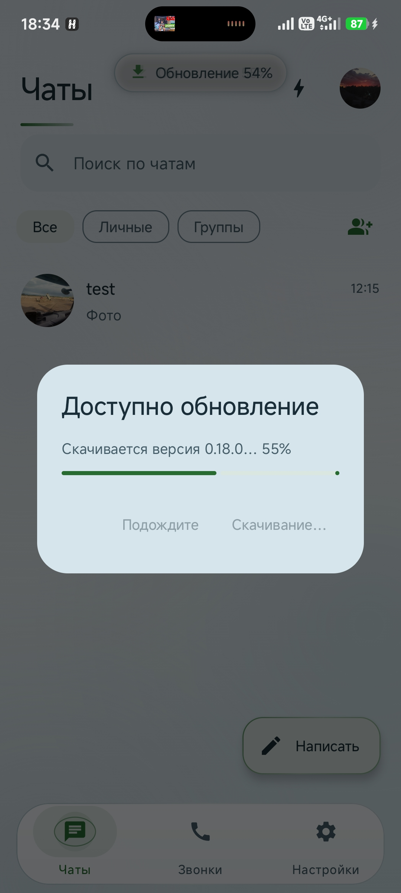
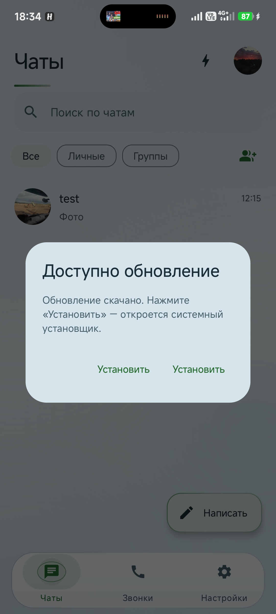
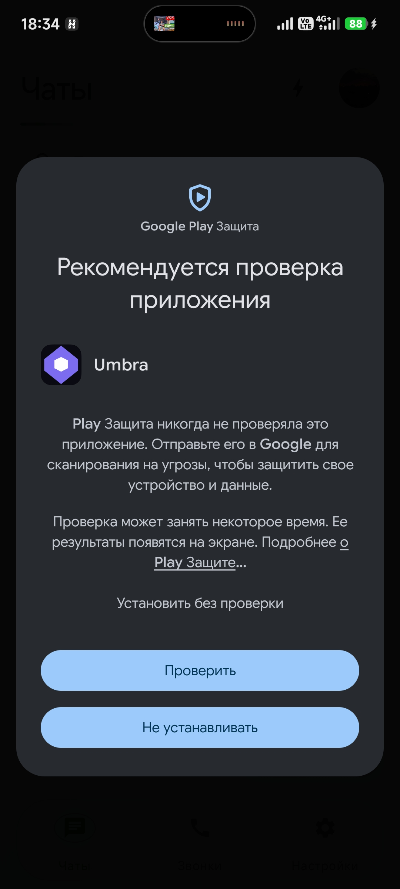
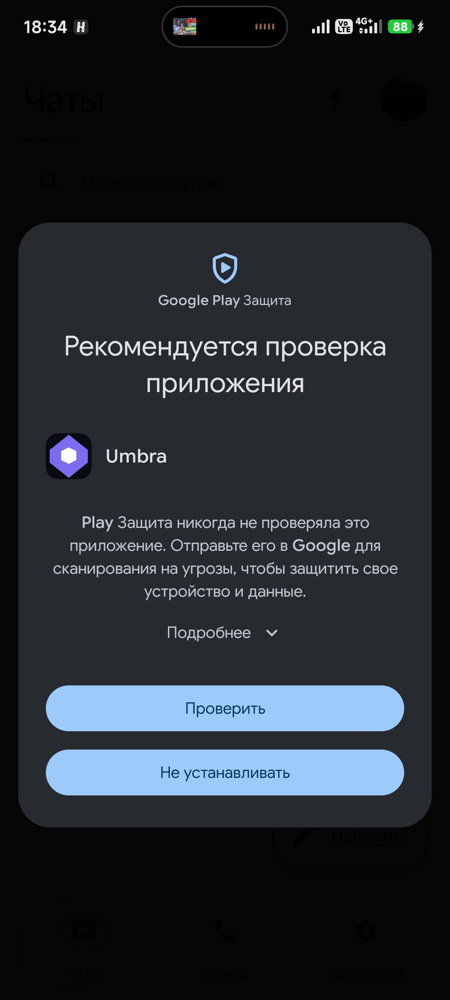

# Обновление Umbra на телефоне

Umbra не распространяется через Google Play: приложение само проверяет версию на
вашем сервере (`/app/latest.json`), скачивает APK, сверяет контрольную сумму
и открывает системный установщик. Данные и вход при этом сохраняются:
подпись сборки не меняется, установка идёт поверх старой версии.

## Шаг 1. Скачивание

При запуске или возврате из фона появляется «Доступно обновление». Нажмите
«Обновить» — начнётся загрузка с процентами. Кнопка «Свернуть» убирает диалог:
загрузка продолжается, прогресс виден в островке сверху, мессенджером можно
пользоваться.



Если связь пропала, повторное нажатие «Повторить» не качает файл с нуля —
загрузка продолжается с места обрыва.

## Шаг 2. Установка

Когда файл скачан и контрольная сумма совпала, остаётся одна кнопка
«Установить» (и «Позже», если хотите отложить).



Если Android попросит разрешение «Установка неизвестных приложений», включите
его для Umbra и вернитесь назад — затем нажмите «Установить» ещё раз.
Разрешение спрашивается один раз.

## Шаг 3. Предупреждение Google Play Защиты

На любой сборке вне Google Play система показывает «Рекомендуется проверка
приложения». Это не ошибка и не признак вируса: Play Просто не видела эту
сборку раньше.



Два варианта:

1. Нажать **«Подробнее»** → **«Установить без проверки»** — быстро, файл никуда
   не отправляется.
2. Нажать **«Проверить»** — APK уйдёт в Google на сканирование и установка
   займёт дольше.



После установки приложение откроется с тем же аккаунтом и перепиской.
Версию можно проверить в «Настройки → О приложении», там же кнопка ручной
проверки обновлений.

## Если что-то пошло не так

| Симптом | Что делать |
| --- | --- |
| «Скачанный файл повреждён» | На сервере `sha256` в `latest.json` не соответствует APK. Пересчитать: `sha256sum umbra-latest.apk` |
| Установщик не открывается | Нет разрешения неизвестных источников: Настройки Android → Приложения → Umbra → «Установка неизвестных приложений» |
| «Приложение не установлено» | Новая сборка подписана другим ключом. Нужно собирать тем же keystore (см. `docs/deploy.md`) |
| Диалог не появляется | Проверьте `curl https://<сервер>/app/latest.json` и что `versionCode` там больше установленного |

## Для владельца сервера: как выкладывать версию

```bash
# 1. скопировать APK в статику nginx
install -m 644 app-release.apk /var/www/umbra/app/umbra-latest.apk

# 2. посчитать контрольную сумму
sha256sum /var/www/umbra/app/umbra-latest.apk

# 3. обновить манифест
cat > /var/www/umbra/app/latest.json <<'JSON'
{
  "versionCode": 43,
  "versionName": "0.18.1",
  "apk": "/app/umbra-latest.apk",
  "sha256": "<сумма из шага 2>",
  "notes": "Что изменилось — одной строкой"
}
JSON
```

Рекомендации по серверу:

- Отдавать APK по **HTTPS** и с поддержкой `Range` (в nginx включена по умолчанию) —
  без этого клиент не сможет докачивать прерванную загрузку.
- `latest.json` должен отдаваться с `Cache-Control: no-cache`, иначе телефоны увидят
  старую версию из кэша.
- `versionCode` обязательно увеличивать: клиент сравнивает именно его, а не `versionName`.
